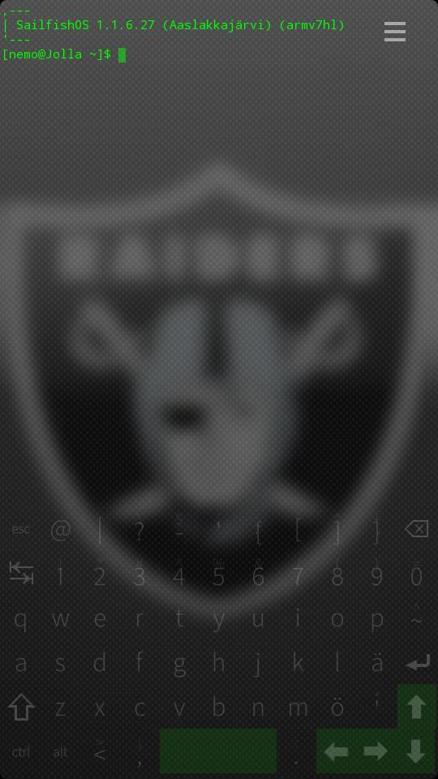
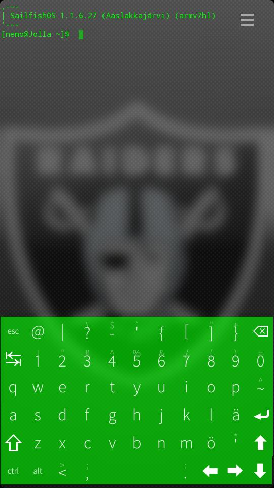

# thumbterm

fingerterm is a terminal emulator designed for Jolla's Jolla device.

#UI tweaks for fingerterm

fingerterm is the Terminal application that ships with Sailfish OS on the
[Jolla smartphone](http://jolla.com).  This fork contains a few UI tweaks
that improve fingerterm's appearance and usability. 

###Usability improvements
- Removed the spacing between keys on the virtual keyboard to maximize key sizes. 
- Reduced the opacity of the keyboard when inactive to make it easier to 
  read text obscured by the inactive keyboard.
- Pressing an arrow key, the Page Up / Page Down key or the space key doesn't 
  activate the keyboard anymore (but the key press is otherwise processed normally). 
  This makes it easier to, for example, navigate long documents in vim.
  You can now scroll through a long document using the arrow keys or the
  Page Up / Page Down key without causing the keyboard to activate and cover most of
  the screen. 
- Disabled auto-repeat for alpha-numeric and special character keys and allow
  swiping from one key to the next (like the built-in keyboard) to facilitate
  correcting tapping mistakes.
- You can now disable the virtual keyboard auto-hide feature by sliding 
  the "VKB delay" slider in the settings all the way to the right.
- Better, smoother scrolling when "Drag mode" is set to "Scroll" in Terminal's
  settings.
- Unset the POSIXLY_CORRECT environment variable on startup as
  [having it set causes bash to start in POSIX mode](http://www.delorie.com/gnu/docs/bash/bashref_62.html#IDX214)
  which causes it to [not read the .bashrc on startup](http://lists.gnu.org/archive/html/bug-bash/2001-10/msg00117.html)

###Cosmetic changes
- Made default font and virtual keyboard green.
- Made the window background translucent.
- Added a cover (full credit to [Thomas Perl](https://github.com/tph) for this code)

##Known issues
Several of these changes required the use of Sailfish OS-specific components.
This fork will therefore only run on Sailfish OS (i.e. on the Jolla). 

##Build instructions

###If you're new to Qt and Sailfish OS development

1) Download and install
   the [Sailfish SDK](https://sailfishos.org/develop.html). 
   As mentioned in the instructions, make sure you have VirtualBox
   installed first.

2) Follow [this tutorial](https://sailfishos.org/develop-firstapp-article.html) 
   to create and run a HelloWorld application. Make sure that you can build and
   run the app in the emulator and on your device.

3) Clone this repo:

    git clone https://github.com/mehdime/fingerterm.git

4) Launch Qt Creator and open the project file (fingerterm.pro).

5) Qt Creator will prompt you to configure the project. Select both the arm and
   the i486 configurations with their default settings.

6) Select the `Projects` tab on the left-hand side and deselect "Shadow build"
   for both the arm and the i486 build settings. When shadow build is enabled,
   Qt Creator will run the build in a folder separate from the project's folder.
   This is generally a good idea especially if you're building for multiple
   platforms as each platform will then have its own build folder containing its
   own build artifacts. But in the case of fingerterm, the fingerterm.spec file,
   which contains packaging instructions, assumes that the build will be done in
   the project folder. So shadow build would cause build errors.

7) If you want to run fingerterm on your device, you should now be able to just
   build and run! 

8) To run it in the emulator, you'll first have to add the `qt-components-qt5`
   and `qt5-qtdeclarative-import-xmllistmodel` packages to the emulator as they
   are required by fingerterm to run. So click the `SailfishOS` tab on
   the left-hand side and click "manage" for the i486 target. Enter
   `qt-components-qt5` in the input field and click "install".
   Do the same for `qt5-qtdeclarative-import-xmllistmodel`.

9) When switching between building for your device and building for 
   the emulator, you must first clean your project folder from build artifacts.
   Otherwise, the new build will fail when the linker tries to link objects
   files built for different platforms together. Git does a good job at making
   sure that your project folder is pristine clean (make sure that you
   understand what this command does before you run it however. It might delete
   files you didn't intend to delete):

    git clean -fdx
